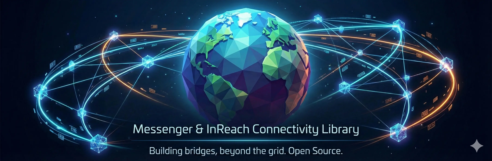

<p align="center">
  
</p>

# Garmin Messenger Client

**Unofficial Garmin Messenger API client for communicating with InReach satellite devices — no hardware required.**

Send and receive messages to Garmin InReach satellite messengers over the internet using just a Garmin Messenger account and a phone number.

[](https://github.com/slush-dev/garmin-messenger/actions/workflows/ci.yml)
[](LICENSE)

---

## What Is This?

Garmin Messenger is a mobile app that lets you exchange text messages with Garmin InReach satellite devices (inReach Mini 2, inReach Messenger, GPSMAP 67i, Montana 700i, etc.) over the internet. This project implements the same messaging protocol as the official app, allowing you to:

- **Send messages** to InReach devices anywhere on Earth via satellite
- **Receive messages** in real-time from InReach devices via WebSocket
- **Download media** attachments (photos, voice messages) from conversations
- **List conversations** and message history
- **Track message delivery status** (sent, delivered, read)
- **Manage conversations** (mute/unmute, block/unblock users)
- **Access location data** shared by InReach devices (GPS coordinates, elevation, speed, heading)

All you need is a phone number registered with Garmin Messenger. No InReach device or Garmin hardware is required on your end.

## Use Cases

- **Home base communication** — Build a desktop or web dashboard for two-way messaging with field teams carrying InReach devices
- **Automated dispatching** — Send automated messages, alerts, or check-ins to satellite devices from your backend
- **Integration with other platforms** — Bridge Garmin Messenger to Slack, Telegram, Discord, email, or SMS
- **Fleet tracking** — Monitor location data and messages from multiple InReach devices programmatically
- **Emergency response** — Build custom alerting systems that receive and forward SOS-adjacent communications
- **IoT and telemetry** — Receive sensor data or status reports from remote InReach-equipped stations

## Repository Structure

```
├── lib/                    Library implementations
│   ├── go/                 Go library (complete, 141 tests)
│   └── python/             Python library (complete, 231 tests)
├── apps/                   Standalone applications
│   ├── go-cli/             Go CLI tool (complete)
│   └── python-cli/         Python CLI tool (complete, 285 tests)
├── tests/                  Cross-implementation test infrastructure
│   └── fixtures/           Shared mock API response data (17 JSON files)
├── docs/                   Protocol & API documentation
└── tools/                  Development tooling
```

## Implementations

| Component | Directory | README |
|---|---|---|
| Go library | [`lib/go/`](lib/go/) | **[Go Library README](lib/go/README.md)** |
| Python library | [`lib/python/`](lib/python/) | **[Python Library README](lib/python/README.md)** |
| Go CLI | [`apps/go-cli/`](apps/go-cli/) | **[Go CLI README](apps/go-cli/README.md)** |
| Python CLI | [`apps/python-cli/`](apps/python-cli/) | **[Python CLI README](apps/python-cli/README.md)** |

> Want to add an implementation or application? Contributions are welcome — see [Contributing](#contributing).

### Library Feature Matrix

| Feature | Go | Python |
|---|:---:|:---:|
| **Authentication** | | |
| SMS OTP registration | ✅ | ✅ |
| Token auto-refresh | ✅ | ✅ |
| Session persistence (save/resume) | ✅ | ✅ |
| **REST API** | | |
| List conversations | ✅ | ✅ |
| Conversation detail (messages) | ✅ | ✅ |
| Conversation members | ✅ | ✅ |
| Send message (text + location) | ✅ | ✅ |
| Send media message (AVIF, OGG) | ✅ | ✅ |
| Download media | ✅ | ✅ |
| Upload media (presigned S3 POST) | ✅ | ✅ |
| Message status (read/delivered) | ✅ | ✅ |
| Batch status updates | ✅ | ✅ |
| Mute/unmute conversations | ✅ | ✅ |
| Block/unblock users | ✅ | ✅ |
| Account capabilities | ✅ | ✅ |
| Network properties (Iridium) | ✅ | ✅ |
| Device metadata (IMEI, satellite) | ✅ | ✅ |
| **Real-Time (SignalR WebSocket)** | | |
| Receive messages | ✅ | ✅ |
| Status updates | ✅ | ✅ |
| Mute/block/notification events | ✅ | ✅ |
| Non-conversational messages | ✅ | ✅ |
| Mark as delivered/read | ✅ | ✅ |
| Query network properties | ✅ | ✅ |
| Auto-reconnect with backoff | ✅ | ✅ |
| **Push Notifications (FCM)** | | |
| Android-native FCM registration | ✅ | ❌ |
| MCS persistent connection | ✅ | ❌ |
| Push notification events | ✅ | ❌ |
| **Registration Management** | | |
| List app/device registrations | ✅ | ❌ |
| Delete app registration | ✅ | ❌ |
| Delete user registration | ✅ | ❌ |
| Update PNS handle (FCM token) | ✅ | ❌ |
| **Utilities** | | |
| Phone → UUID conversion | ✅ | ✅ |
| OTA UUID generation | ✅ | ✅ |

### CLI Feature Matrix

| Command | Go | Python |
|---|:---:|:---:|
| `login` | ✅ | ✅ |
| `login` auto-registers FCM | ✅ | ❌ |
| `conversations` | ✅ | ✅ |
| `messages` | ✅ | ✅ |
| `send` (text + location + media) | ✅ | ✅ |
| `listen` (SignalR real-time) | ✅ | ✅ |
| `listen` FCM catch-up for missed messages | ✅ | ❌ |
| `media` (download attachment) | ✅ | ✅ |
| `members` | ✅ | ✅ |
| `mute` / `muted` | ✅ | ✅ |
| `sync-contacts` | ✅ | ✅ |
| `network` | ✅ | ✅ |
| `device-metadata` | ✅ | ✅ |
| `registrations list` | ✅ | ❌ |
| `registrations delete` | ✅ | ❌ |
| `registrations cleanup` | ✅ | ❌ |
| `fcm-register` (debug) | ✅ | ❌ |
| `mcp` (MCP server for LLM integration) | ✅ | ❌ |
| `--yaml` output on all commands | ✅ | ✅ |
| `--version` | ✅ | ❌ |

## Quick Start

### Go CLI (single binary, no runtime)

```bash
make build-go-cli    # outputs build/go/garmin-messenger

build/go/garmin-messenger login --phone "+1234567890"
build/go/garmin-messenger conversations
build/go/garmin-messenger send --to "+1234567890" --message "Hello from base!"
build/go/garmin-messenger listen
build/go/garmin-messenger media CONVERSATION_ID MESSAGE_ID    # download attachment
```

### Python CLI

```bash
python3 -m venv .venv && source .venv/bin/activate
pip install -e lib/python && pip install -e apps/python-cli

garmin-messenger login --phone "+1234567890"
garmin-messenger conversations
garmin-messenger send --to "+1234567890" --message "Hello from base!"
garmin-messenger listen
garmin-messenger media CONVERSATION_ID MESSAGE_ID    # download attachment
```

### Library usage

See [lib/go/README.md](lib/go/README.md) (Go) and [lib/python/README.md](lib/python/README.md) (Python) for library usage examples.

## Authentication Flow

All implementations use the same SMS OTP (one-time password) authentication flow, matching the official Garmin Messenger app:

1. You provide your phone number registered with Garmin Messenger
2. The client sends a registration request to the Hermes API
3. Garmin sends a 6-digit verification code via SMS to your phone
4. You enter the code to complete authentication
5. The server returns an access token, refresh token, and instance ID
6. Credentials are saved locally (`~/.garmin-messenger/`) for reuse

Tokens are automatically refreshed when they expire. Sessions persist across restarts.

## Protocol Reference

Base URL: `https://hermes.inreachapp.com`

For the full API reference with request/response examples, see **[docs/api-reference.md](docs/api-reference.md)**.

### REST API Overview

| Area | Endpoints | Description |
|---|---|---|
| Registration | `/Registration/App`, `/App/Confirm`, `/App/Refresh` | SMS OTP auth and token management |
| Conversations | `/Conversation/Updated`, `/Conversation/Details/{id}`, `/Conversation/Members/{id}`, `/Conversation/Muted` | List, inspect, and manage conversations |
| Messages | `/Message/Send`, `/Message/DeviceMetadata`, `/Message/Media/*` | Send messages, media attachments, satellite device info |
| Status | `/Status/Read`, `/Status/Delivered`, `/Status/Update`, `/Status/Updated` | Read receipts, batch updates |
| User Info | `/UserInfo/Capabilities`, `/UserInfo/Block` | Account capabilities, block/unblock |
| Network | `/NetworkInfo/Properties` | Iridium satellite network status |

### SignalR WebSocket

Hub path: `/messaging`

Real-time events: `ReceiveMessage`, `ReceiveMessageUpdate`, `ReceiveConversationMuteStatusUpdate`, `ReceiveUserBlockStatusUpdate`, `ReceiveServerNotification`, `ReceiveNonconversationalMessage`

Client invocations: `MarkAsDelivered`, `MarkAsRead`, `NetworkProperties`

## Development

```bash
# Run all tests
make test

# Lint all code
make lint

# Run only Go tests
make test-go

# Run only Python tests
make test-python

# Build Go CLI binary
make build-go-cli

# Install Python library in dev mode
make build-python-lib

# See all targets
make help
```

## Requirements

- A phone number registered with the [Garmin Messenger](https://www.garmin.com/en-CA/p/893837/) app
- Internet connection
- No Garmin hardware required on the client side

For implementation-specific requirements, see the respective README.

## FAQ

**Do I need an InReach device?**
No. You only need a Garmin Messenger account (free app, registered with a phone number). The person you're communicating with uses the InReach device.

**What InReach devices are supported?**
Any device compatible with Garmin Messenger: inReach Mini 2, inReach Messenger, GPSMAP 66i/67i, Montana 700i/750i, Overlander, and others.

**Is this the same as the Garmin/Explore API?**
No. This uses the Garmin Messenger (Hermes) protocol, which is the backend for the Garmin Messenger mobile app. It is separate from the Garmin Connect or Explore APIs.

**Can I use this for group conversations?**
Yes. The API supports multi-member conversations. Send messages to multiple recipients by passing multiple phone numbers.

**How does authentication work?**
Same as the official app: SMS-based one-time password. You get a text message with a 6-digit code each time you register a new session.

**Do sessions expire?**
Access tokens expire but are automatically refreshed using the stored refresh token. Sessions persist across restarts as long as the saved credentials file exists.

**Can I send messages to phone numbers (not InReach devices)?**
Yes. Garmin Messenger supports messaging between app users (phone-to-phone) and between app users and InReach devices.

## Contributing

Contributions are welcome! Particularly:

- **New language implementations** — Rust, C, TypeScript/Node.js
- **Applications** — CLI tools, chat bots, bridges to other platforms
- **Documentation** — Improvements to API docs, examples, and guides
- **Test infrastructure** — Conformance tests, mock server, fixtures

Please open an issue first to discuss significant changes.

## Disclaimer

This is an unofficial, community-built client. It is not affiliated with, endorsed by, or supported by Garmin Ltd. Use at your own risk. Garmin may change their API at any time, which could break this client.

## License

[MIT](LICENSE)

---

**Keywords:** Garmin Messenger API, Garmin InReach API client, InReach satellite messenger, send message to InReach, Garmin Messenger Go library, Garmin Messenger Python library, InReach two-way messaging, Garmin satellite communication SDK, InReach Mini 2 API, Garmin Messenger protocol, Hermes API, satellite messenger integration, InReach automation, Garmin Messenger bot, InReach REST API, Garmin Messenger WebSocket, Garmin inReach SDK
